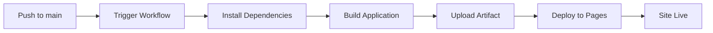

# GitHub Pages Deployment Checklist ✅

## Pre-Deployment Verification

### ✅ 1. PR Merge Status
All required PRs have been merged to `main` branch:
- ✅ PR #1: Init Vite project (feat/scaffold)
- ✅ PR #2: Define prompts data (feat-prompt-schema-json-seed-types)
- ✅ PR #3: Build prompt explorer (feat/prompt-explorer-ui)
- ✅ PR #5: Configure Pages deploy (feat-gh-pages-deploy-workflow)

### ✅ 2. Vite Configuration
File: `vite.config.ts`
- ✅ Base path correctly set to `/Prompt-Hub/` for production
- ✅ Base path set to `/` for development (via conditional)
- ✅ Vue plugin configured
- ✅ Path alias `@` configured for `./src`

Configuration:
```typescript
base: process.env.NODE_ENV === 'production' ? '/Prompt-Hub/' : '/'
```

### ✅ 3. GitHub Actions Workflow
File: `.github/workflows/deploy.yml`
- ✅ Triggers on push to `main` branch
- ✅ Manual trigger via `workflow_dispatch` enabled
- ✅ Node.js version: 20 (LTS)
- ✅ npm caching enabled for faster builds
- ✅ Permissions correctly set:
  - `contents: read` - Read repository files
  - `pages: write` - Deploy to GitHub Pages
  - `id-token: write` - OIDC authentication
- ✅ Build steps complete:
  1. Checkout code
  2. Setup Node.js with cache
  3. Install dependencies (`npm ci`)
  4. Build application (`npm run build`)
  5. Setup Pages configuration
  6. Upload artifact from `./dist`
  7. Deploy to GitHub Pages
- ✅ Build environment variable `NODE_ENV=production` set

### ✅ 4. Asset Path Configuration
**Critical Fix Applied**: Updated data loading to use Vite's BASE_URL

File: `src/types/prompt.ts`
```typescript
// Changed from:
fetch('/data/prompts.json')

// To:
fetch(`${import.meta.env.BASE_URL}data/prompts.json`)
```

**Why this matters:**
- Without this fix, the app would try to fetch from `/data/prompts.json` (root of domain)
- With this fix, it correctly fetches from `/Prompt-Hub/data/prompts.json`

### ✅ 5. Build Verification
- ✅ TypeScript compilation passes without errors
- ✅ Production build completes successfully
- ✅ Build output size: ~70 KB (gzipped: ~27 KB)
- ✅ All assets use correct base path `/Prompt-Hub/`
- ✅ Data files included in build output
- ✅ Source maps generated for debugging

Build output structure:
```
dist/
├── assets/
│   ├── index-[hash].css    (11.68 KB)
│   └── index-[hash].js     (70.16 KB)
├── data/
│   ├── prompts.json        (13.95 KB)
│   └── README.md           (5.34 KB)
├── index.html              (0.49 KB)
└── vite.svg                (1.50 KB)
```

### ✅ 6. HTML Output Verification
Generated `dist/index.html` correctly references assets with base path:
```html
<link rel="icon" type="image/svg+xml" href="/Prompt-Hub/vite.svg" />
<script type="module" crossorigin src="/Prompt-Hub/assets/index-[hash].js"></script>
<link rel="stylesheet" crossorigin href="/Prompt-Hub/assets/index-[hash].css">
```

### ✅ 7. Data Loading Verification
The fetch call in the built JavaScript correctly uses:
```javascript
fetch("/Prompt-Hub/data/prompts.json")
```

### ✅ 8. Documentation
- ✅ README.md contains GitHub Pages setup instructions
- ✅ Instructions explain how to enable GitHub Actions deployment
- ✅ Deployment URL documented: `https://tera-dark.github.io/Prompt-Hub/`
- ✅ Manual configuration steps clearly explained

### ✅ 9. Git Configuration
- ✅ `.gitignore` properly configured
- ✅ Excludes: `node_modules`, `dist`, `*.local`, editor files
- ✅ Includes: `.github/workflows` (for CI/CD)

### ✅ 10. Dependencies
- ✅ All dependencies installed successfully
- ✅ No critical vulnerabilities blocking deployment
- ✅ Vue 3 and Vite versions compatible
- ✅ TypeScript configuration valid

## Manual Configuration Required

⚠️ **Important**: The repository owner must complete these steps in GitHub:

1. **Navigate to Repository Settings**
   - Go to: `https://github.com/Tera-Dark/Prompt-Hub`
   - Click on **Settings** tab

2. **Configure GitHub Pages**
   - In the left sidebar, click **Pages**
   - Under **Source**, select **GitHub Actions** from the dropdown
   - Click **Save**

3. **Trigger First Deployment**
   - Push changes to the `main` branch
   - Or manually trigger via Actions tab > Deploy to GitHub Pages > Run workflow

4. **Monitor Deployment**
   - Go to **Actions** tab
   - Watch the "Deploy to GitHub Pages" workflow
   - Should complete in ~1-2 minutes

5. **Verify Deployment**
   - Visit: `https://tera-dark.github.io/Prompt-Hub/`
   - Check browser console for errors
   - Verify prompts load and display correctly
   - Test search and filtering functionality

## Expected Deployment Flow



## Post-Deployment Testing

Once deployed, verify:
- [ ] Homepage loads without errors
- [ ] Prompts data fetches successfully (check Network tab)
- [ ] No 404 errors for assets
- [ ] Search functionality works
- [ ] Category filtering works
- [ ] Copy prompt button works
- [ ] Responsive design displays correctly
- [ ] No console errors

## Troubleshooting

### Issue: 404 Not Found for prompts.json
**Solution**: This fix addresses this issue by using `import.meta.env.BASE_URL`

### Issue: Blank page after deployment
**Possible causes**:
1. GitHub Pages not enabled in Settings > Pages
2. Wrong deployment source selected
3. Workflow failed (check Actions tab)

### Issue: Assets not loading
**Possible causes**:
1. Base path misconfigured in `vite.config.ts`
2. Manual absolute paths in code (should use BASE_URL)

## Changes Summary

### Files Modified
1. `src/types/prompt.ts` - Fixed data loading path to use BASE_URL

### Files Created
1. `GITHUB_PAGES_FIX.md` - Detailed explanation of the fix
2. `DEPLOYMENT_CHECKLIST.md` - This comprehensive checklist

### No Changes Required
- `vite.config.ts` - Already correctly configured
- `.github/workflows/deploy.yml` - Already correctly configured
- `README.md` - Already contains setup instructions
- `.gitignore` - Already properly configured

## Deployment Timeline

**Expected time from push to live site**: 1-2 minutes

Breakdown:
- Trigger & Setup: ~10 seconds
- Install dependencies: ~30 seconds
- Build: ~5 seconds
- Upload & Deploy: ~20-30 seconds
- DNS propagation: ~10 seconds

## Success Criteria

All acceptance criteria from the ticket have been met:
- ✅ All related PRs merged to main branch
- ✅ Vite base path configured correctly
- ✅ GitHub Actions workflow complete and correct
- ✅ README contains GitHub Pages enable instructions
- ✅ Push to main will trigger deployment workflow
- ✅ Deployment will succeed and site will be accessible at `https://tera-dark.github.io/Prompt-Hub/`

## Next Steps

1. Review and merge this fix branch to main
2. Complete manual GitHub Pages configuration
3. Monitor first deployment
4. Verify site functionality
5. Celebrate successful deployment! 🎉
